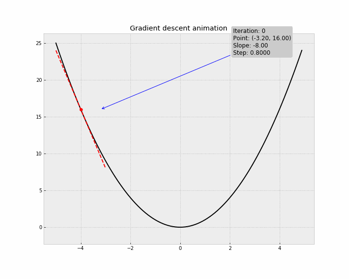
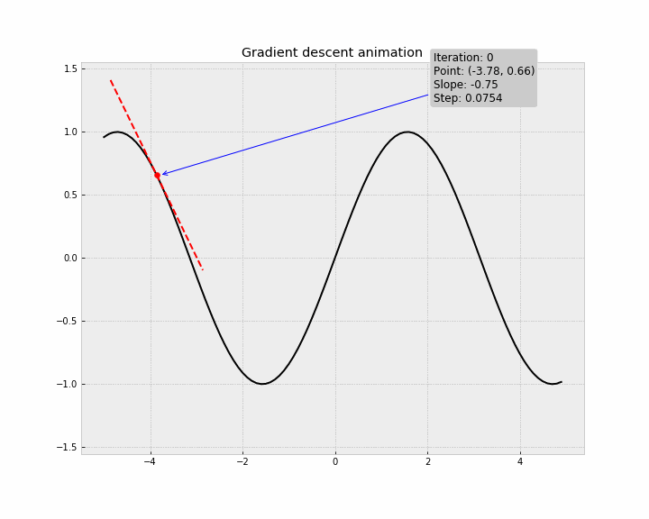

# Neural Network from Scratch

This repository is part of the coursework for the Introduction to Artificial Intelligence course of [Novo Ensino Suplementar](https://novoensinossuplementar.com). The primary goal of this project is to build a neural network from scratch, implementing fundamental components such as neurons, activation functions, forward propagation, backpropagation, and gradient descent without relying on high-level libraries like TensorFlow or PyTorch. This project serves as a comprehensive guide to understanding the theoretical and mathematical foundations of neural networks, as well as their practical implementation.

## Table of Contents

- [Introduction](#introduction)
- [What is a Neural Network?](#what-is-a-neural-network)
- [Neurons and Layers](#neurons-and-layers)
  - [Neurons](#neurons)
  - [Layers](#layers)
- [Weights and Biases](#weights-and-biases)
  - [Weights](#weights)
  - [Biases](#biases)
    - [Why do we need biases?](#why-do-we-need-biases)
- [Activation Functions](#activation-functions)
  - [Why do we need activation functions?](#why-do-we-need-activation-functions)
  - [Sigmoid](#sigmoid)
  - [ReLU](#relu)
  - [Softmax](#softmax)
  - [Tanh](#tanh-hyperbolic-tangent)
- [Forward Propagation](#forward-propagation)
  - [Generalization of Forward Propagation](#generalization-of-forward-propagation)
- [Cost Function](#cost-function)
  - [Mean Squared Error](#mean-squared-error-mse)
  - [Cross-Entropy Loss](#cross-entropy-loss)
  - [Why do we need cost functions?](#why-do-we-need-cost-functions)
  - [Example: Using Cross-Entropy Loss in a Neural Network](#example-using-cross-entropy-loss-in-a-neural-network)
  - [Predicted Probabilities and Actual Labels](#predicted-probabilities-and-actual-labels)
    - [Notation](#notation)
    - [Predicted Probabilities ($`\hat{\textbf{Y}}`$)](#predicted-probabilities-hattextbfy)
    - [Actual Labels ($`\mathbf{Y}`$)](#actual-labels-mathbfy)
  - [Real Example: Using Cross-Entropy Loss in a Neural Network](#real-example-using-cross-entropy-loss-in-a-neural-network)
- [Gradient and Gradient Descent](#gradient-and-gradient-descent)
  - [Gradient](#gradient)
  - [Gradient Descent](#gradient-descent)
  - [Geometric Interpretation](#geometric-interpretation)
  - [Animated Examples](#animated-examples)
- [How $`\theta`$ looks like](#how-theta-looks-like)
  - [Example: Flattening the parameters](#example-flattening-the-parameters)
- [Backpropagation](#backpropagation)
- [Training the Neural Network](#training-the-neural-network)
- [Epochs](#epochs)
- [Example with Digit Recognition](#example-with-digit-recognition)
- [Conclusion](#conclusion)

---

### Introduction

Welcome to the "Neural Network from Scratch" project! The primary goal of this project is to build a neural network from the ground up, without using high-level machine learning libraries like TensorFlow or PyTorch. By doing so, we aim to provide a deep understanding of the inner workings of neural networks, including the theoretical and mathematical rigor behind them.

### What is a Neural Network?

A neural network is a computational model inspired by the human brain, composed of layers of interconnected nodes or neurons. These networks are capable of learning complex patterns and functions by adjusting the connections (weights) between neurons based on the data they are trained on. It's not a linear model because we have [activation functions](#activation-functions) to introduce non-linearity. Because of this, a neural network can learn more complex patterns than a linear model.

### Neurons and Layers

#### Neurons

Neurons are the fundamental building blocks of a neural network, functioning as computational units that process input data and produce output signals. Each neuron receives one or more input values, applies a weight to each input, sums the results, adds a bias, and then passes this sum through an activation function to produce the output.

Mathematically, a neuron's operation can be expressed as:

$$ z = \displaystyle \sum_{i=1}^{n} w_i \times x_i + b $$

where $z$ is the weighted sum of the inputs plus the bias, each $w_i$ and $x_i$ are the weights and input values respectively, and $b$ is the bias.

After the activation function is applied to the weighted sum, the output of the neuron is the result of the operation, as follows:

$$ a = \sigma(z) $$

where $\sigma$ is the activation function and the result $a$ is the output of the neuron.

> We'll discuss _bias_ and _activation functions_ in the [weights and biases](#weights-and-biases) and [activation functions](#activation-functions) sections respectively.

#### Layers

Layers refer to collections of neurons arranged sequentially. Each layer transforms the output of the previous layer through a series of weighted sums and activation functions.

> We'll explain the mathematical workings in the [forward propagation](#forward-propagation) section.

There are three main types of layers in a neural network:

- **Input layer:** The first layer that directly receives the raw input data. This layer does not perform any operations; it simply passes the data to the next layer. For many types of problems, the input data is represented as vectors. Each data point is a vector of features. In our example ([Digit Recognition](#example-with-digit-recognition)), the input data is a set of images where each image is a $28 \times 28$ pixel grid, which is represented as a vector of length $784 = 28 \times 28$ entries of pixel intensity.

- **Hidden layer:** Intermediate layers located between the input and output layers. These layers perform the bulk of the computation and feature extraction. Each hidden layer consists of neurons that apply weights, biases, and activation functions to the inputs received from the previous layer. Hidden layers are crucial for capturing complex patterns in the input data.

- **Output layer:** The final layer that produces the network's predictions or outputs. The number of neurons in this layer typically corresponds to the number of classes in a classification problem or the dimensionality of the target variable in a regression problem. The activation function used in this layer depends on the nature of the problem (e.g., [softmax](#softmax) for multi-class classification, and [sigmoid](#sigmoid) for binary classification).

### Weights and Biases

#### Weights

Are numerical values associated with the **connections** between neurons. They determine the strenght of these connections and, in turn, the influence that one neurons's input. Think of weights as the coefficients that adjust the **impact** of incoming data. They can increase or decrease the _importance_ of specific features in the input data.

Weights are fundementally tied to the connections between neurons rather tha the neurons themselves because they **represent how the output of one neuron affects the input of another**. Each wight adjusts the influece of a specific input feature or the output from a previous layer on the next neuron.

In mathematical terms, if we have two neurons $N_i$ and $N_j$, with $N_i$ providing an output $a_i$ and $N_j$ receiving this output as an input, the weight $w_{ij}$ determines how strongly $a_i$ affects the input to $N_j$. The weighted sum of inputs into $N_j$ can be expressed as:

$$ z_j = \displaystyle \sum_{i} w_{ij} \times a_i + b_j $$

where $z_j$ is the input to neuron $N_j$ **before** applying the activation function, $w_{ij}$ is the weight associated with the **connection** from $N_i$ to $N_j$, $a_i$ is the activation (output) of $N_i$, and $b_j$ is the bias of the $N_j$ neuron.

#### Biases

Are additional parameters in a neural network that allow the activation function to be shuft left or right. They are added to the weighted sum of the inputs before applying the activation function. This helps the model to learn patterns more effectively by providing an extra degree of freedom.

$$ z_j = \displaystyle \sum_{i} w_{ij} \times a_i + b_j $$

##### Why do we need biases?

By adding a bias term, the activation function can be shifted horizontally. This allow the network to learn and represent paterns that are not centered around the origin. In other workds, biases enabled the adjustment of the activation threshold, without a bias, the neuron can hae a non-zero output even when the inputs are zero.

This **prevents Dead Neurons**!! In activation function like [ReLU](#relu), a bias helps aboid dead neurons (neurons that output zero for all inputs) by ensuring that some neurons are activated even with low input values.

### Activation Functions

Are mathematical equations that determine the output a neural network model. They **introduce non-linearity into the network, allowing it to learn and model complex patterns in the data**. Without activation functions, a neural network would simply be a linear regression model, unable to capture the intricate structures inherent in most real-world problems.

#### Why do we need activation functions?
1. **Introduces non-linearity:** Real-world data is often non-linear. Activation functions allow the neural networkd to capture non-linear patterns and relationships in the data.
2. **Enable Deep Learning:** By stacking multiple layers with non-linear activation functions, the network can learn hierarchical features and deep representations.
3. **Control Output Range:** Can also help in controlling the output range of neurons, making the network more stable and ensuring that the output are in a desirable range.

The following activation functions are commonly used in neural networks:

#### Sigmoid

The *sigmoid* function maps any real-valued number into the range $\left]0, 1\right[$, making it useful for binary classification.

$$ \sigma(z) = \frac{1}{1 + e^{-z}} $$

<p align="center">
  
</p>

> In logistic regression and binary classification neural networks, the sigmoid function is used in the output layer to predict the probability that an input belongs to a particular class.

**Use Case:**
- Predicting whether an email is spam or not spam.

A possible implementation can be found [here](https://todo.com/add/here).

#### ReLU

The *Rectified Linear Unit (ReLU)* function is widely used in hidden layers due to its simplicity and efficiency.

$$ \text{ReLU}(z) = \max(0, z) $$

<p align="center">
  
</p>

> ReLU is commonly used in hidden layers of deep neural networks because it helps mitigate the vanishing gradient problem, allowing models to learn faster and perform better.

**Use Case:**
- Image recognition tasks where deep [convolutional neural networks (CNNs)](https://towardsdatascience.com/a-comprehensive-guide-to-convolutional-neural-networks-the-eli5-way-3bd2b1164a53) are used.


A possible implementation can be found [here](https://todo.com/add/here).


#### Softmax

The *softmax* function converts a vector of values into a probability distribution, often used in the output layer for multi-class classification.

$$ \text{softmax}(z_i) = \frac{e^{z_i}}{\sum_{j} e^{z_j}} $$

<p align="center">
  
</p>

> In networks designed for multi-class classification problems, softmax is used in the output layer to represent the probability distribution over multiple classes.

**Use Case:**
- Handwritten digit recognition (e.g., MNIST dataset) where the network predicts the digit (0-9) in an image.

A possible implementation can be found [here](https://todo.com/add/here).

#### Tanh (Hyperbolic Tangent)

The *tanh* functions maps any real-valued number into the range $\left]-1, 1\right[$. It is a scaled version of the sigmoid function.

$$ \text{Tanh}(z) = \frac{e^{z} - e^{-z}}{e^{z} + e^{-z}} $$

<p align="center">
  
</p>

> Is often used in hidden layers of neural networks, especially for models dealing with zero-centered data.


You can see more a lot of other activation functions [on this Medium Article](https://medium.com/aimonks/a-comprehensive-guide-to-activation-functions-in-deep-learning-ff794f87c184).


### Forward Propagation

> The things is starting to get complicated.

Forward Propagation is the process by wich data passes through a neural network layer by layer to produce an output. this process involves a series of matrix multiplications and the application of activation functions. Foward propagation is crucial as it allows the neural network to make predictions based on the input data.

<p align="center">
  
</p>

There are two major steps performed in forward propagation techically:

1. **Sum the Product:** This steps involves multiplying the weight vector by the input vector. This operation is repreated for each layer in the netwrodk until the final layer, where a decision is made based on the calculated values.

2. **Activation Functions:** The sum of the product of weights and inputs is passed through an activation function at each layer. The output of one layer becomes de input for the next layer, where it is again multiplied by the weight vector and passed through an activation function. This process continues untul de output layer, where the final output is produced.

<p align="center">
  
</p>


In a **feedforward neural network**, forward propagation is straightforward to understand. Let's break it down with an example where each layer uses the sigmoid activation function:

- **Input Layer:** $\mathbf{X}$ is the initial input vector.

- **Weights and Biases:** Each layer $l$ has an associated weight vector $\mathbf{W^{(l)}}$ and bias $\mathbf{b^{(l)}}$.

- **Sum of Products:** For each neuron in a layer, the sum of the product of the inputs and weights plus the bias is calculated. For example, if $u_1$ and $u_2$ are the sums in the first hidden layer, so they will be calculated as:

$$ u_1 = \mathbf{W}^{(1)} \mathbf{X} + \mathbf{b}^{(1)} $$
$$ u_2 = \mathbf{W}^{(2)} \mathbf{A}^{(1)} + \mathbf{b}^{(2)} $$

- **Activation Function:** Each sum $u_i$ is then passed through the sigmoid activation function to produce the activations $a_i$:

$$ a_1 = \sigma(u_1) = \frac{1}{1 + e^{-u_1}} $$
$$ a_2 = \sigma(u_2) = \frac{1}{1 + e^{-u_2}} $$

- **Output Layer:** The final predicted value $\hat{y}$ is produced after the last activation function is applied:

$$ \hat{y} = \sigma(u_3) $$


#### Generalization of Forward Propagation

With this example we can generalize the process to any number of layers and arbitrary activation functions, we can represent the operations mathematically in a compact form.

Let's denote:
- $\mathbf{L}$ as the number of layers in the network.
- $n_i$ as the number of neurons in the $i$-th layer.
- $\mathbf{X}$ as the input vector.
- $\mathbf{W}^{(l)}$ as the weight matrix connecting layer $l-1$ to layer $l$.
- $\mathbf{b}^{(l)}$ as the bias vector for layer $l$-th layer.
- $\mathbf{Z}^{(l)}$ as the sum of products for layer $l$-th layer. (also called pre-activation vector)
- $\mathbf{A}^{(l)}$ as the activation vector for layer $l$-th layer.

The forward propagation process can be described as follows:

1. **Input Layer (Layer 0):**

$$ \mathbf{A}^{(0)} = \mathbf{X} $$

2. **Hidden Layers and Output Layer (Layer 1 to L):**
For each $i = 1, 2, \ldots, L$:

$$ \mathbf{Z}^{(i)} = \mathbf{W}^{(i)} \mathbf{A}^{(i-1)} + \mathbf{b}^{(i)} $$

$$ \mathbf{A}^{(i)} = \sigma_i(\mathbf{Z}^{(i)}) $$

To represent the entire forward propagation in a single expression, consider the final output $\mathbf{A}^{(L)}$ as the result of applying all the weights, biases and activation functions from the input to the output layer.

So, given the notation above, the generalized forward propagation for a neural network with $L$ layers can be expressed as:

$$ \mathbf{A}^{(L)} = \sigma_L \left( \mathbf{W}^{(L)} \sigma_{L-1} \left( \mathbf{W}^{(L-1)} \cdots \sigma_2 \left( \mathbf{W}^{(2)} \sigma_1 \left( \mathbf{W}^{(1)} \mathbf{X} + \mathbf{b}^{(1)} \right) + \mathbf{b}^{(2)} \right) \cdots + \mathbf{b}^{(L-1)} \right) + \mathbf{b}^{(L)} \right) $$


### Cost Function

Also known as the loss function or error function, measures how well the neural network's predictions match the actual target values. It quentifies the difference between the predicted outputs and the true outputs, guiding the optimization process during training.

The following cost functions are commonly used in neural networks:

#### Mean Squared Error (MSE)

Is commonly used for regression problems. It calculates the average of the squared differences between the predicted and actual values.

$$ \textbf{MSE} = \frac{1}{n} \sum_{i=1}^{n} (y_i - \hat{y}_i)^2 $$

where $n$ is the number of training examples, $\hat{y}_i$ is the predicted value, and $y_i$ is the actual value for the $i$-th training example.

An implementation can be found [here](https://todo.com/add/here).

#### Cross-Entropy Loss
Also known as Log Loss, is widely used for classification probelms. It measures the difference between two probability distributions: the predicted distribution and the true distribution.

$$ \textbf{Cross-Entropy Loss} = - \frac{1}{n} \sum_{i=1}^{n} \sum_{j=1}^{c} y_{ij} \log(\hat{y}_{ij}) $$

where $n$ is the number of training examples, $`\hat{y}_{ij}`$ is the predicted probability of the $i$-th training example belonging to the $j$-th class, $y_{ij}$ is the actual probability for the $i$-th training example belonging to the $j$-th class, and $c$ is the number of classes.

An implementation can be found [here](https://todo.com/add/here).

#### Why do we need cost functions?
During the neural network training process, the goal is to minimize the const function. This is achieved trhough optimization algorithms like gradient descent, wich iterativewly adjust the network's weights and biases to reduce the cost function. The lower the cost function, the better the network's performance (predictions match the actual target values).

#### Example: Using Cross-Entropy Loss in a Neural Network
Consider a Neural Network with the following structure:

- **Input Layer:** $\textbf{X}$.
- **Weights and Biases:** $\textbf{W}^{(l)}$ and $\textbf{b}^{(l)}$ for each layer $l$.
- **Activation Functions:** $\sigma^{(l)}$ for each layer $l$.
- **Output Layer:** Produces predicted probabilities $\hat{\textbf{Y}}$.

So we apply the foward propagation process:
1. **Input Layer:**

$$ \textbf{A}^{(0)} = \textbf{X} $$

2. **Hidden Layers:**
For each $l = 1, 2, \ldots, L - 1$:

$$ \textbf{Z}^{(l)} = \textbf{W}^{(l)} \textbf{A}^{(l-1)} + \textbf{b}^{(l)} $$

$$ \textbf{A}^{(l)} = \sigma^{(l)} \left( \textbf{Z}^{(l)} \right) $$

3. **Output Layer:**

$$ \hat{\textbf{Y}} = \textbf{A}^{(L)} = \textbf{softmax} \left( \textbf{Z}^{(L)} \right) =  \textbf{softmax} \left( \textbf{W}^{(L)} \textbf{A}^{(L-1)} + \textbf{b}^{(L)} \right) $$

Now, given the predicted probabilities $\hat{\textbf{Y}}$ and the actual probabilities (labels) $\textbf{Y}$, we can calculate the cost function:

$$ \textbf{Cross-Entropy Loss} = - \frac{1}{n} \sum_{i=1}^{n} \sum_{j=1}^{c} y_{ij} \log(\hat{y}_{ij}) $$

#### Predicted Probabilities and Actual Labels
In the context of neural networks, especially for classification tasks, the predicted probabilities and actual labels can be represented as vectors or matrices, depending on the type of classification problem (binary or multi-class).

##### Notation

- $i$: Represents the index of the input example, ranging from 1 to $m$, where $m$ is the total number of examples in the dataset.
- $j$: Represents the index of the class, ranging from 1 to $c$, where $c$ is the total number of classes.
- $y_{ij}$: Represents the actual label of the $i$-th example for the $j$-th class. It is 1 if the example belongs to the class, and 0 otherwise in the case of one-hot encoding.
- $\hat{y}_{ij}$: Represents the predicted probability of the $i$-th example belonging to the $j$-th class.

##### Predicted Probabilities ($\hat{\textbf{Y}}$)
Are the outputs of a neural network after applying the activation function in the output layer (typically [sotfmax](#softmax) for multi-class classification). These probabilities indicate the likelihood of each input beloging to each possible class.

- **Binary Classification:** The predicted probabilities for a binary classification problem can be represented as a vector, where each element corresponds to the probability of the input belonging to the positive class.

$$ \hat{\mathbf{Y}} = [\hat{y}_1, \hat{y}_2, \ldots, \hat{y}_m] $$

where $\hat{y}_i$ is the predicted probability for the $i$-th example.

- **Multi-Class Classification:** The predicted probabilities for a multi-class classification problem are represented as a matrix, where each row corresponds to an input example and each column corresponds to a class.

```math
\hat{\mathbf{Y}} = \begin{bmatrix}
  \hat{y}_{11} & \hat{y}_{12} & \ldots & \hat{y}_{1c} \\
  \hat{y}_{21} & \hat{y}_{22} & \ldots & \hat{y}_{2c} \\
  \vdots & \vdots & \ddots & \vdots \\
  \hat{y}_{m1} & \hat{y}_{m2} & \ldots & \hat{y}_{mc}
\end{bmatrix}
```

where $\hat{y}_{ij}$ is the predicted probability of the $i$-th example belonging to the $j$-th class.

##### Actual Labels ($\mathbf{Y}$)

The actual labels are the ground truth values that indicate the true class of each input example. These can also be represented as vectors or matrices, depending on the problem.

- **Binary Classification:** The actual labels for binary classification can be represented as a vector, where each element is either 0 or 1, indicating the class of each example.

$$ \mathbf{Y} = [y_1, y_2, \ldots, y_m] $$

where $y_i$ is the actual label for the $i$-th example (0 or 1).

- **Multi-Class Classification:** The actual labels for multi-class classification are typically represented as a one-hot encoded matrix, where each row corresponds to an input example and each column corresponds to a class. Each element in the matrix is either 0 or 1.

```math
\mathbf{Y} = \begin{bmatrix}
  y_{11} & y_{12} & \ldots & y_{1c} \\
  y_{21} & y_{22} & \ldots & y_{2c} \\
  \vdots & \vdots & \ddots & \vdots \\
  y_{m1} & y_{m2} & \ldots & y_{mc}
\end{bmatrix}
```
  where $y_{ij}$ is 1 if the $i$-th example belongs to the $j$-th class, and 0 otherwise.

#### Real Example: Using Cross-Entropy Loss in a Neural Network

For a dataset with 3 examples and 4 classes, the predicted probabilities and actual labels could be represented as follows:

- **Predicted Probabilities ($\hat{\mathbf{Y}}$):**

$$
\hat{\mathbf{Y}} = \begin{bmatrix}
  0.1 & 0.5 & 0.2 & 0.2 \\
  0.3 & 0.4 & 0.2 & 0.1 \\
  0.2 & 0.3 & 0.4 & 0.1
\end{bmatrix}
$$


- **Actual Labels ($\mathbf{Y}$):**

$$
\mathbf{Y} = \begin{bmatrix}
  0 & 1 & 0 & 0 \\
  1 & 0 & 0 & 0 \\
  0 & 0 & 1 & 0
\end{bmatrix}
$$

- **Cross-Entropy Loss Calculation:**

Using the matrices above, the cross-entropy loss for multi-class classification is calculated as:

$$
\text{Cross-Entropy Loss} = -\frac{1}{3} \sum_{i=1}^{3} \sum_{j=1}^{4} y_{ij} \log(\hat{y}_{ij})
$$

This formulation ensures that the loss function measures how well the predicted probabilities match the actual labels, guiding the optimization process to improve the neural network's performance.

<details>

<summary>Expanded Calculation</summary>

Expanding the sums, we get:

For the first example ($i = 1$):

$$\text{Loss}_1 = - \left( 0 \log(0.1) + 1 \log(0.5) + 0 \log(0.2) + 0 \log(0.2) \right) = - \log(0.5)$$

For the second example ($i = 2$):

$$\text{Loss}_2 = - \left( 1 \log(0.3) + 0 \log(0.4) + 0 \log(0.2) + 0 \log(0.1) \right) = - \log(0.3)$$

For the third example ($i = 3$):

$$\text{Loss}_3 = - \left( 0 \log(0.2) + 0 \log(0.3) + 1 \log(0.4) + 0 \log(0.1) \right) = - \log(0.4)$$

The average cross-entropy loss is then:

$$\text{Cross-Entropy Loss} = -\frac{1}{3} \left( \log(0.5) + \log(0.3) + \log(0.4) \right)$$

Breaking it down step by step:

- First Example Loss Calculation:

$$\text{Loss}_1 = - (0 \cdot \log(0.1) + 1 \cdot \log(0.5) + 0 \cdot \log(0.2) + 0 \cdot \log(0.2)) = - \log(0.5)$$

- Second Example Loss Calculation:

$$\text{Loss}_2 = - (1 \cdot \log(0.3) + 0 \cdot \log(0.4) + 0 \cdot \log(0.2) + 0 \cdot \log(0.1)) = - \log(0.3)$$

- Third Example Loss Calculation:

$$\text{Loss}_3 = - (0 \cdot \log(0.2) + 0 \cdot \log(0.3) + 1 \cdot \log(0.4) + 0 \cdot \log(0.1)) = - \log(0.4)$$

Finally, combine these to compute the overall average cross-entropy loss:

$$\text{Cross-Entropy Loss} = -\frac{1}{3} \left( \log(0.5) + \log(0.3) + \log(0.4) \right)$$

This expanded calculation demonstrates how the cross-entropy loss measures the difference between the predicted probabilities and the actual labels, guiding the optimization process to improve the neural network's performance.
</details>


### Gradient and Gradient Descent

In this section, we will delve into the concepts of the gradient, gradient descent, and their geometric interpretation. Understanding these concepts is crucial for grasping how neural networks are optimized during training.

#### Gradient

The gradient of a function is a vector that contains all the partial derivatives of the function with respect to its input variables. **It points in the direction of the steepest ascent of the function**.

For a function $f(x_1, x_2, \ldots, x_n)$, the gradient $\nabla f$ is given by:

$$ \nabla f = \left( \frac{\partial f}{\partial x_1}, \frac{\partial f}{\partial x_2}, \ldots, \frac{\partial f}{\partial x_n} \right)$$

The gradient vector provides the **direction and rate of the fastest increase** of the function. In the context of neural networks, the cost function $\mathcal{L}(\mathbf{\theta})$ depends on the parameters $\mathbf{\theta}$ (weights and biases), and the gradient of $\mathcal{L}$ with respect to $\mathbf{\theta}$ is used to update these parameters to minimize the cost function.

#### Gradient Descent

Gradient descent is **an optimization algorithm** used to **minimize a function by iteratively moving in the direction of the steepest descent**, as defined by the negative of the gradient.

The update rule for gradient descent is:

$$ \mathbf{\theta} \leftarrow \mathbf{\theta} - \alpha \nabla \mathcal{L}(\mathbf{\theta}) $$

where:
- $\mathbf{\theta}$ represents the parameters of the model (weights and biases).
- $\alpha$ is the learning rate, a small positive number that controls the step size.
- $\nabla \mathcal{L}(\mathbf{\theta})$ is the gradient of the cost function with respect to the parameters.

#### Geometric Interpretation

Geometrically, the gradient points in the direction of the steepest ascent of the function, and the negative gradient points in the direction of the steepest descent. By following the negative gradient, we move towards the minimum of the function.

For example, consider a simple quadratic function $f(x, y) = x^2 + y^2$:

- The gradient of $f$ is $\nabla f = (2x, 2y)$.
- The negative gradient is $-\nabla f = (-2x, -2y)$.

Starting from an initial point $(x_0, y_0)$, we update the point using gradient descent:

$$ x \leftarrow x - \alpha \cdot 2x $$
$$ y \leftarrow y - \alpha \cdot 2y $$

This iterative process moves the point towards the origin, which is the minimum of the function.

#### Animated Examples

The following animations illustrate the concept of gradient descent:

1. $f(x) = x^2$: A classical example of the gradient descent algorithm in a 1D function.

<p align="center">
  
</p>

2. $f(x) = \sin(x)$: An animation demonstrating the iterative process of gradient descent on $\sin$ function.

<p align="center">
  
</p>

3. $f(x, y) = \sin \left( \frac{1}{2} x^2 - \frac{1}{4}y^2 + 3 \right) \cos \left( 2x + 1 - e^y \right)$: An animation demonstrating the iterative process of gradient descent on the multivariable function $f$ where the domain is a surface.

<p align="center">
  
</p>


> Animation credits: [Kaggle](https://www.kaggle.com/code/trolukovich/animating-gradien-descent).

### How $\theta$ Looks Like

In a neural network, the parameters (weights and biases) for each layer are represented as matrices and vectors. To apply gradient descent efficiently, these parameters are often **flattened into a single vector $\mathbf{\theta}$**. This allows for easy computation and updates.

#### Example: Flattening the parameters

Consider a simple neural network with one hidden layer:
- **Input layer**: 3 neurons
- **Hidden layer**: 4 neurons
- **Output layer**: 2 neurons

The weights and biases are as follows:
- $\mathbf{W}^{(1)}$: Weight matrix from the input layer to the hidden layer (4x3)
- $\mathbf{b}^{(1)}$: Bias vector for the hidden layer (4x1)
- $\mathbf{W}^{(2)}$: Weight matrix from the hidden layer to the output layer (2x4)
- $\mathbf{b}^{(2)}$: Bias vector for the output layer (2x1)

So, the parameters $\mathbf{\theta}$ can be represented as follows:

1. **Weights for the first layer (\(\mathbf{W}^{(1)}\))**:

$$\mathbf{W}^{(1)} = \begin{bmatrix}
w_{11}^{(1)} & w_{12}^{(1)} & w_{13}^{(1)} \\
w_{21}^{(1)} & w_{22}^{(1)} & w_{23}^{(1)} \\
w_{31}^{(1)} & w_{32}^{(1)} & w_{33}^{(1)} \\
w_{41}^{(1)} & w_{42}^{(1)} & w_{43}^{(1)}
\end{bmatrix}$$

2. **Biases for the first layer (\(\mathbf{b}^{(1)}\))**:

$$\mathbf{b}^{(1)} = \begin{bmatrix}
b_{1}^{(1)} \\
b_{2}^{(1)} \\
b_{3}^{(1)} \\
b_{4}^{(1)}
\end{bmatrix}$$

3. **Weights for the second layer (\(\mathbf{W}^{(2)}\))**:

$$\mathbf{W}^{(2)} = \begin{bmatrix}
w_{11}^{(2)} & w_{12}^{(2)} & w_{13}^{(2)} & w_{14}^{(2)} \\
w_{21}^{(2)} & w_{22}^{(2)} & w_{23}^{(2)} & w_{24}^{(2)}
\end{bmatrix}$$

4. **Biases for the second layer (\(\mathbf{b}^{(2)}\))**:

$$\mathbf{b}^{(2)} = \begin{bmatrix}
b_{1}^{(2)} \\
b_{2}^{(2)}
\end{bmatrix}$$

The flattened parameter vector $\mathbf{\theta}$ is created by concatenating all the flattened weight matrices and bias vectors:

$$\mathbf{\theta} = \begin{bmatrix}
w_{11}^{(1)}, w_{12}^{(1)}, w_{13}^{(1)}, w_{21}^{(1)}, w_{22}^{(1)}, w_{23}^{(1)}, w_{31}^{(1)}, w_{32}^{(1)}, w_{33}^{(1)}, w_{41}^{(1)}, w_{42}^{(1)}, w_{43}^{(1)}, b_{1}^{(1)}, b_{2}^{(1)}, b_{3}^{(1)}, b_{4}^{(1)}, w_{11}^{(2)}, w_{12}^{(2)}, w_{13}^{(2)}, w_{14}^{(2)}, w_{21}^{(2)}, w_{22}^{(2)}, w_{23}^{(2)}, w_{24}^{(2)}, b_{1}^{(2)}, b_{2}^{(2)}
\end{bmatrix}$$

By flattening the parameters into a single vector, we simplify the application of gradient descent and other optimization algorithms, making the training process more efficient and easier to implement.

### Backpropagation

_Coming soon_

### Training the Neural Network

_Coming soon_

### Epochs

_Coming soon_

### Example with Digit Recognition

_Coming soon_

### Conclusion

_Coming soon_
