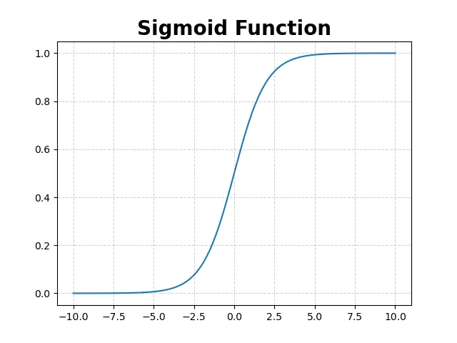
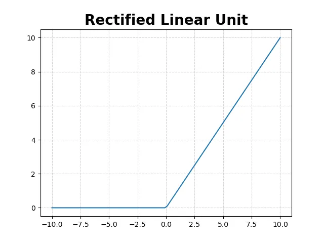
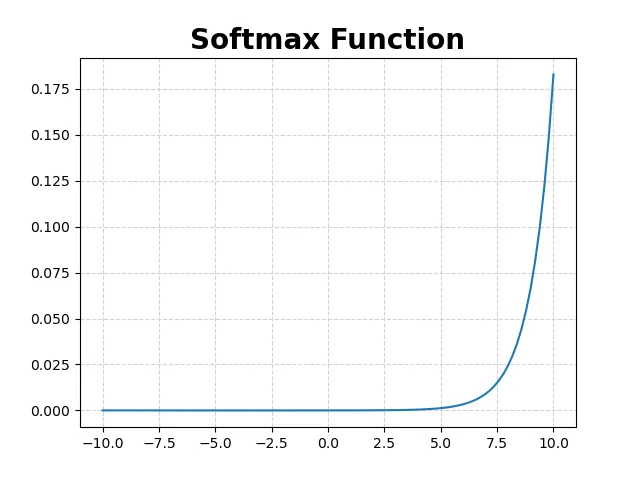
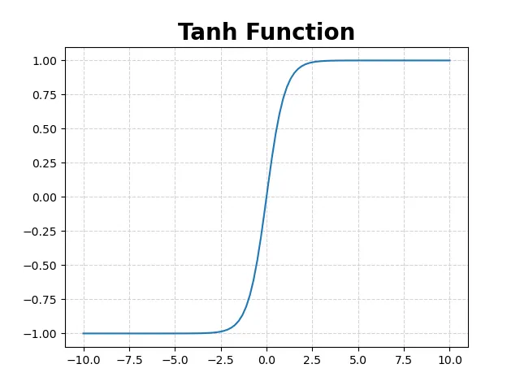
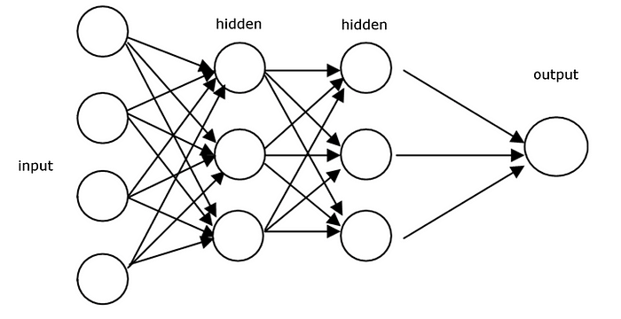
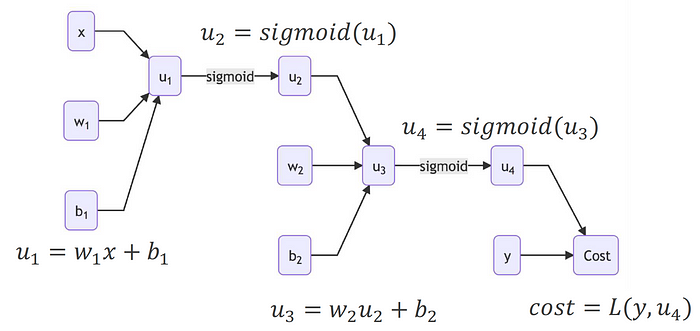

# Neural Network from Scratch

This repository is part of the coursework for the Introduction to Artificial Intelligence course of [Novo Ensino Suplementar](https://novoensinossuplementar.com). The primary goal of this project is to build a neural network from scratch, implementing fundamental components such as neurons, activation functions, forward propagation, backpropagation, and gradient descent without relying on high-level libraries like TensorFlow or PyTorch. This project serves as a comprehensive guide to understanding the theoretical and mathematical foundations of neural networks, as well as their practical implementation.

## Table of Contents

- [Introduction](#introduction)
- [What is a Neural Network?](#what-is-a-neural-network)
- [Neurons and Layers](#neurons-and-layers)
  - [Neurons](#neurons)
  - [Layers](#layers)
- [Weights and Biases](#weights-and-biases)
  - [Weights](#weights)
  - [Biases](#biases)
    - [Why do we need biases?](#why-do-we-need-biases)
- [Activation Functions](#activation-functions)
  - [Why do we need activation functions?](#why-do-we-need-activation-functions)
  - [Sigmoid](#sigmoid)
  - [ReLU](#relu)
  - [Softmax](#softmax)
  - [Tanh](#tanh-hyperbolic-tangent)
- [Forward Propagation](#forward-propagation)
- [Cost Function](#cost-function)
- [Backpropagation](#backpropagation)
- [Gradient Descent](#gradient-descent)
- [Training the Neural Network](#training-the-neural-network)
- [Epochs](#epochs)
- [Example with Digit Recognition](#example-with-digit-recognition)
- [Conclusion](#conclusion)

---

### Introduction

Welcome to the "Neural Network from Scratch" project! The primary goal of this project is to build a neural network from the ground up, without using high-level machine learning libraries like TensorFlow or PyTorch. By doing so, we aim to provide a deep understanding of the inner workings of neural networks, including the theoretical and mathematical rigor behind them.

### What is a Neural Network?

A neural network is a computational model inspired by the human brain, composed of layers of interconnected nodes or neurons. These networks are capable of learning complex patterns and functions by adjusting the connections (weights) between neurons based on the data they are trained on. It's not a linear model because we have [activation functions](#activation-functions) to introduce non-linearity. Because of this, a neural network can learn more complex patterns than a linear model.

### Neurons and Layers

#### Neurons

Neurons are the fundamental building blocks of a neural network, functioning as computational units that process input data and produce output signals. Each neuron receives one or more input values, applies a weight to each input, sums the results, adds a bias, and then passes this sum through an activation function to produce the output.

Mathematically, a neuron's operation can be expressed as:

$$ z = \displaystyle \sum_{i=1}^{n} w_i \times x_i + b $$

where $z$ is the weighted sum of the inputs plus the bias, each $w_i$ and $x_i$ are the weights and input values respectively, and $b$ is the bias.

After the activation function is applied to the weighted sum, the output of the neuron is the result of the operation, as follows:

$$ a = \sigma(z) $$

where $\sigma$ is the activation function and the result $a$ is the output of the neuron.

> We'll discuss _bias_ and _activation functions_ in the [weights and biases](#weights-and-biases) and [activation functions](#activation-functions) sections respectively.

#### Layers

Layers refer to collections of neurons arranged sequentially. Each layer transforms the output of the previous layer through a series of weighted sums and activation functions.

> We'll explain the mathematical workings in the [forward propagation](#forward-propagation) section.

There are three main types of layers in a neural network:

- **Input layer:** The first layer that directly receives the raw input data. This layer does not perform any operations; it simply passes the data to the next layer. For many types of problems, the input data is represented as vectors. Each data point is a vector of features. In our example ([Digit Recognition](#example-with-digit-recognition)), the input data is a set of images where each image is a $28 \times 28$ pixel grid, which is represented as a vector of length $784 = 28 \times 28$ entries of pixel intensity.

- **Hidden layer:** Intermediate layers located between the input and output layers. These layers perform the bulk of the computation and feature extraction. Each hidden layer consists of neurons that apply weights, biases, and activation functions to the inputs received from the previous layer. Hidden layers are crucial for capturing complex patterns in the input data.

- **Output layer:** The final layer that produces the network's predictions or outputs. The number of neurons in this layer typically corresponds to the number of classes in a classification problem or the dimensionality of the target variable in a regression problem. The activation function used in this layer depends on the nature of the problem (e.g., [softmax](#softmax) for multi-class classification, and [sigmoid](#sigmoid) for binary classification).

### Weights and Biases

#### Weights

Are numerical values associated with the **connections** between neurons. They determine the strenght of these connections and, in turn, the influence that one neurons's input. Think of weights as the coefficients that adjust the **impact** of incoming data. They can increase or decrease the _importance_ of specific features in the input data.

Weights are fundementally tied to the connections between neurons rather tha the neurons themselves because they **represent how the output of one neuron affects the input of another**. Each wight adjusts the influece of a specific input feature or the output from a previous layer on the next neuron.

In mathematical terms, if we have two neurons $N_i$ and $N_j$, with $N_i$ providing an output $a_i$ and $N_j$ receiving this output as an input, the weight $w_{ij}$ determines how strongly $a_i$ affects the input to $N_j$. The weighted sum of inputs into $N_j$ can be expressed as:

$$ z_j = \displaystyle \sum_{i} w_{ij} \times a_i + b_j $$

where $z_j$ is the input to neuron $N_j$ **before** applying the activation function, $w_{ij}$ is the weight associated with the **connection** from $N_i$ to $N_j$, $a_i$ is the activation (output) of $N_i$, and $b_j$ is the bias of the $N_j$ neuron.

#### Biases

Are additional parameters in a neural network that allow the activation function to be shuft left or right. They are added to the weighted sum of the inputs before applying the activation function. This helps the model to learn patterns more effectively by providing an extra degree of freedom.

$$ z_j = \displaystyle \sum_{i} w_{ij} \times a_i + b_j $$

##### Why do we need biases?

By adding a bias term, the activation function can be shifted horizontally. This allow the network to learn and represent paterns that are not centered around the origin. In other workds, biases enabled the adjustment of the activation threshold, without a bias, the neuron can hae a non-zero output even when the inputs are zero.

This **prevents Dead Neurons**!! In activation function like [ReLU](#relu), a bias helps aboid dead neurons (neurons that output zero for all inputs) by ensuring that some neurons are activated even with low input values.

### Activation Functions

Are mathematical equations that determine the output a neural network model. They **introduce non-linearity into the network, allowing it to learn and model complex patterns in the data**. Without activation functions, a neural network would simply be a linear regression model, unable to capture the intricate structures inherent in most real-world problems.

#### Why do we need activation functions?
1. **Introduces non-linearity:** Real-world data is often non-linear. Activation functions allow the neural networkd to capture non-linear patterns and relationships in the data.
2. **Enable Deep Learning:** By stacking multiple layers with non-linear activation functions, the network can learn hierarchical features and deep representations.
3. **Control Output Range:** Can also help in controlling the output range of neurons, making the network more stable and ensuring that the output are in a desirable range.

The following activation functions are commonly used in neural networks:

#### Sigmoid

The *sigmoid* function maps any real-valued number into the range $\left]0, 1\right[$, making it useful for binary classification.

$$ \sigma(z) = \frac{1}{1 + e^{-z}} $$

  

> In logistic regression and binary classification neural networks, the sigmoid function is used in the output layer to predict the probability that an input belongs to a particular class.

**Use Case:**
- Predicting whether an email is spam or not spam.

A possible implementation can be found [here](https://todo.com/add/here).

#### ReLU

The *Rectified Linear Unit (ReLU)* function is widely used in hidden layers due to its simplicity and efficiency.

$$ \text{ReLU}(z) = \max(0, z) $$

  

> ReLU is commonly used in hidden layers of deep neural networks because it helps mitigate the vanishing gradient problem, allowing models to learn faster and perform better.

**Use Case:**
- Image recognition tasks where deep [convolutional neural networks (CNNs)](https://towardsdatascience.com/a-comprehensive-guide-to-convolutional-neural-networks-the-eli5-way-3bd2b1164a53) are used.

A possible implementation can be found [here](https://todo.com/add/here).

#### Softmax

The *softmax* function converts a vector of values into a probability distribution, often used in the output layer for multi-class classification.

$$ \text{softmax}(z_i) = \frac{e^{z_i}}{\sum_{j} e^{z_j}} $$

  

> In networks designed for multi-class classification problems, softmax is used in the output layer to represent the probability distribution over multiple classes.

**Use Case:**
- Handwritten digit recognition (e.g., MNIST dataset) where the network predicts the digit (0-9) in an image.

A possible implementation can be found [here](https://todo.com/add/here).

#### Tanh (Hyperbolic Tangent)

The *tanh* functions maps any real-valued number into the range $\left]-1, 1\right[$. It is a scaled version of the sigmoid function.

$$ \text{Tanh}(z) = \frac{e^{z} - e^{-z}}{e^{z} + e^{-z}} $$

  

> Is often used in hidden layers of neural networks, especially for models dealing with zero-centered data.

You can see more a lot of other activation functions [on this Medium Article](https://medium.com/aimonks/a-comprehensive-guide-to-activation-functions-in-deep-learning-ff794f87c184).

### Forward Propagation

> The things is starting to get complicated.

Forward Propagation is the process by wich data passes through a neural network layer by layer to produce an output. this process involves a series of matrix multiplications and the application of activation functions. Foward propagation is crucial as it allows the neural network to make predictions based on the input data.

  

There are two major steps performed in forward propagation techically:

1. **Sum the Product:** This steps involves multiplying the weight vector by the input vector. This operation is repreated for each layer in the netwrodk until the final layer, where a decision is made based on the calculated values.

2. **Activation Functions:** The sum of the product of weights and inputs is passed through an activation function at each layer. The output of one layer becomes de input for the next layer, where it is again multiplied by the weight vector and passed through an activation function. This process continues untul de output layer, where the final output is produced.

  

In a **feedforward neural network**, forward propagation is straightforward to understand. Let's break it down with an example where each layer uses the sigmoid activation function:

- **Input Layer:** $\mathbf{X}$ is the initial input vector.

- **Weights and Biases:** Each layer $l$ has an associated weight vector $\mathbf{W^{(l)}}$ and bias $\mathbf{b^{(l)}}$.

- **Sum of Products:** For each neuron in a layer, the sum of the product of the inputs and weights plus the bias is calculated. For example, if $u_1$ and $u_2$ are the sums in the first hidden layer, so they will be calculated as:

$$ u_1 = \mathbf{W}^{(1)} \mathbf{X} + \mathbf{b}^{(1)} $$
$$ u_2 = \mathbf{W}^{(2)} \mathbf{A}^{(1)} + \mathbf{b}^{(2)} $$

- **Activation Function:** Each sum $u_i$ is then passed through the sigmoid activation function to produce the activations $a_i$:

$$ a_1 = \sigma(u_1) = \frac{1}{1 + e^{-u_1}} $$
$$ a_2 = \sigma(u_2) = \frac{1}{1 + e^{-u_2}} $$

- **Output Layer:** The final predicted value $\hat{y}$ is produced after the last activation function is applied:

$$ \hat{y} = \sigma(u_3) $$

#### Generalization of Forward Propagation

With this example we can generalize the process to any number of layers and arbitrary activation functions, we can represent the operations mathematically in a compact form.

Let's denote:
- $\mathbf{L}$ as the number of layers in the network.
- $n_i$ as the number of neurons in the $i$-th layer.
- $\mathbf{X}$ as the input vector.
- $\mathbf{W}^{(l)}$ as the weight matrix connecting layer $l-1$ to layer $l$.
- $\mathbf{b}^{(l)}$ as the bias vector for layer $l$-th layer.
- $\mathbf{Z}^{(l)}$ as the sum of products for layer $l$-th layer. (also called pre-activation vector)
- $\mathbf{A}^{(l)}$ as the activation vector for layer $l$-th layer.

The forward propagation process can be described as follows:

1. **Input Layer (Layer 0):**

$$ \mathbf{A}^{(0)} = \mathbf{X} $$

2. **Hidden Layers and Output Layer (Layer 1 to L):**
For each $i = 1, 2, \ldots, L$:

$$ \mathbf{Z}^{(i)} = \mathbf{W}^{(i)} \mathbf{A}^{(i-1)} + \mathbf{b}^{(i)} $$

$$ \mathbf{A}^{(i)} = \sigma_i(\mathbf{Z}^{(i)}) $$

To represent the entire forward propagation in a single expression, consider the final output $\mathbf{A}^{(L)}$ as the result of applying all the weights, biases and activation functions from the input to the output layer.

So, given the notation above, the generalized forward propagation for a neural network with $L$ layers can be expressed as:

$$ \mathbf{A}^{(L)} = \sigma_L \left( \mathbf{W}^{(L)} \sigma_{L-1} \left( \mathbf{W}^{(L-1)} \cdots \sigma_2 \left( \mathbf{W}^{(2)} \sigma_1 \left( \mathbf{W}^{(1)} \mathbf{X} + \mathbf{b}^{(1)} \right) + \mathbf{b}^{(2)} \right) \cdots + \mathbf{b}^{(L-1)} \right) + \mathbf{b}^{(L)} \right) $$

### Cost Function

_Coming soon_

### Backpropagation

_Coming soon_

### Gradient Descent

_Coming soon_

### Training the Neural Network

_Coming soon_

### Epochs

_Coming soon_

### Example with Digit Recognition

_Coming soon_

### Conclusion

_Coming soon_
